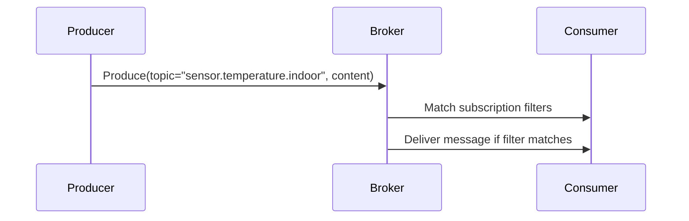
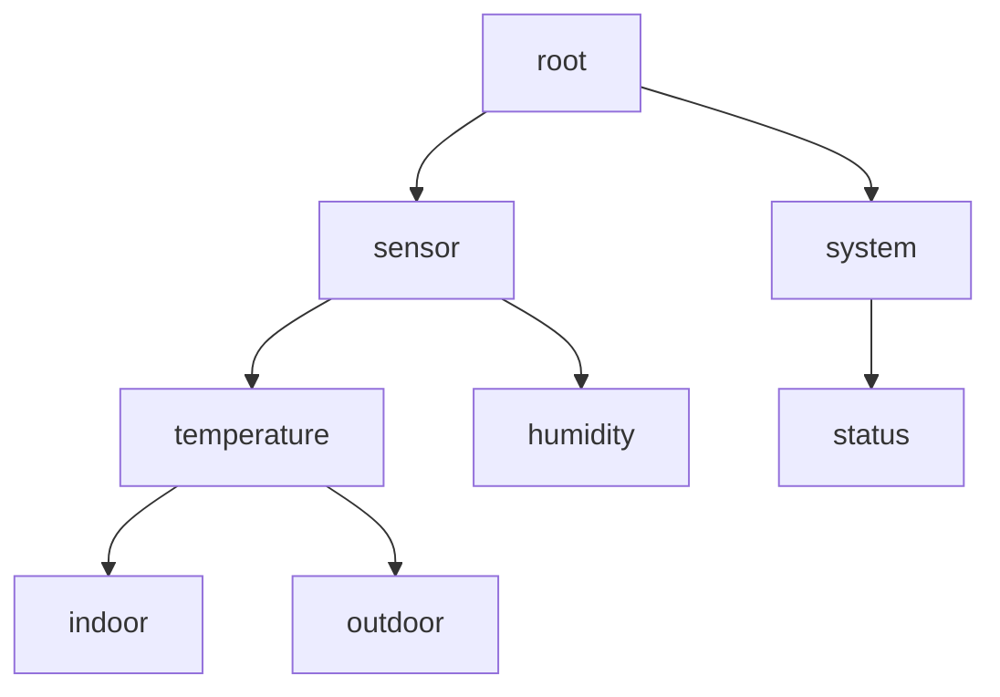

# IMITTO Protocol Workflow

## Sequence

```mermaid
sequenceDiagram
    participant Producer
    participant Broker
    participant Consumer

    Producer->>Broker: Produce(topic="sensor.temperature.indoor", content)
    Broker->>Consumer: Match subscription filters
    Broker->>Consumer: Deliver message if filter matches
```

## Topic Hierarchy

```mermaid
graph TD
    A[root]
    A --> B[sensor]
    B --> C[temperature]
    C --> D[indoor]
    C --> E[outdoor]
    B --> F[humidity]
    A --> G[system]
    G --> H[status]
```
